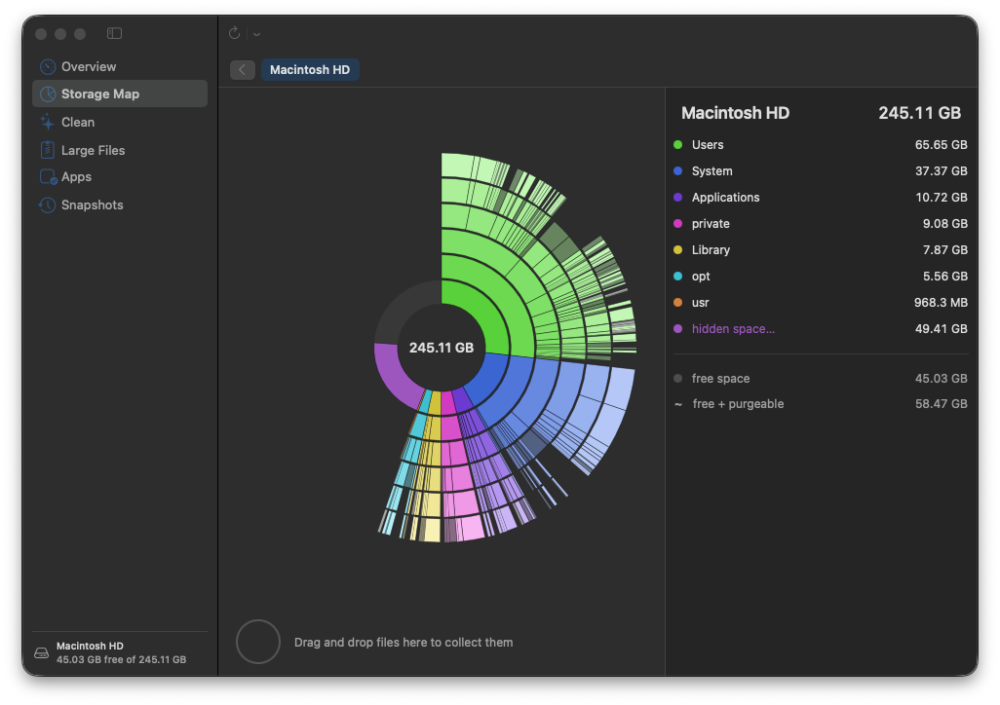

<p align="center">
  
</p>

<h1 align="center">Broom</h1>

<p align="center">
  See where your Mac's storage went and clean it safely. Free, open source, no subscription.
</p>

<p align="center">
  <a href="https://github.com/Dunebru/broom/releases/latest"></a>
  <a href="https://github.com/Dunebru/broom/releases"></a>
  
  
  <a href="LICENSE"></a>
</p>

<p align="center">
  <a href="https://github.com/Dunebru/broom/releases/latest"></a>
</p>

Broom does what CleanMyMac and DaisyDisk charge for, in one native app. It draws your disk as a sunburst so the big folders jump out, and it knows which caches, logs, build folders, installers and old backups are safe to remove.

<details>
<summary>Table of contents</summary>

- [Features](#features)
- [Install](#install)
- [Requirements](#requirements)
- [Usage](#usage)
- [What Broom will and won't delete](#what-broom-will-and-wont-delete)
- [FAQ](#faq)
- [Build from source](#build-from-source)
- [License](#license)
- [Acknowledgements](#acknowledgements)

</details>

## Features

- **Storage map** - a sunburst of your whole disk or any folder. Each ring is one level deeper, petal width is size. Hover for details, click to dive in, click the center to go back. Colors match the legend on the right, free space shows as the empty gap
- **Fast scans** - reads directory metadata in bulk with `getattrlistbulk`, so a 1 million file disk maps in under 10 seconds. Hard links are counted once, other volumes and mounted images are skipped
- **Clean** - app caches, logs, Xcode build data, simulator caches, package manager caches (Homebrew, npm, pip, uv, Yarn, pnpm, Cargo, CocoaPods), Mail attachment cache, installers in Downloads, old iPhone backups, Trash. Every category explains what it is and why it is safe
- **App leftovers** - finds support folders, caches, preferences and containers left behind by apps you already deleted
- **Uninstaller** - removes an app together with everything it scattered across your Library
- **Large files** - filter by size and age, straight from the scan
- **Snapshots** - lists and deletes Time Machine local snapshots that keep "purgeable" space locked
- **Collector** - drag items from the legend to collect them, delete the pile once, with one confirmation
- **Native** - SwiftUI, light and dark mode, respects Reduce Motion, 3 MB app

## Install

### Download

Get **Broom.zip** from the [latest release](https://github.com/Dunebru/broom/releases/latest), unzip, and move **Broom.app** to your Applications folder.

The app is not notarized. The first time you open it: **right-click → Open → Open**. If macOS still refuses:

```bash
xattr -dr com.apple.quarantine /Applications/Broom.app
```

### Permissions

- macOS asks for access to **Downloads, Desktop and Documents** on the first scan. Say yes, or those folders show as empty.
- For a complete picture grant **Full Disk Access** (System Settings → Privacy & Security → Full Disk Access). Without it, Mail, Safari and Time Machine data stay hidden and totals run lower than Finder's. Broom shows a reminder until you do.

## Requirements

macOS 14 Sonoma or newer, Apple silicon or Intel.

## Usage

<details open>
<summary><b>Find what is eating your disk</b></summary>

1. Open **Storage Map** and press **Scan** (whole disk) or use ⌘R for just your home folder.
2. Hover any petal for its name and size. Click a folder to zoom in, click the center or use the breadcrumbs to go back up.
3. Drag items from the legend to the collector at the bottom, or right-click for **Reveal in Finder** and **Move to Trash**.

</details>

<details>
<summary><b>Clean safely</b></summary>

1. Open **Clean**. Broom lists every category with its size and a plain-English explanation.
2. Categories marked **REVIEW** are off by default. Expand a category to pick individual items.
3. Press **Clean**. Caches and logs are deleted (they regenerate). Everything else goes to the Trash, so you can undo.

</details>

<details>
<summary><b>Remove an app completely</b></summary>

Open **Apps → Installed Apps**, pick the app, review its related data, press **Uninstall**. The **Leftovers** tab shows data from apps you deleted in the past.

</details>

## What Broom will and won't delete

Broom is deliberately conservative:

| Will remove | Won't touch |
|---|---|
| `~/Library/Caches/*` (except iCloud, Safari, Spotify) | `/Library/Caches`, `/System`, anything outside your home folder |
| `~/Library/Logs/*` except crash reports | `DiagnosticReports` (Apple Support needs them) |
| Xcode DerivedData, simulator caches | Xcode Archives and Device Support unless you opt in |
| Package manager caches | Gradle caches unless you opt in |
| Installers (`.dmg`, `.pkg`, `.xip`) in Downloads | Anything else in Downloads |
| iPhone backups except the newest | The most recent backup |

Nothing is removed without a confirmation dialog. Files that can be useful again go to the Trash, not straight to oblivion.

## FAQ

**Why is "hidden space" in the legend?**
That is space macOS reports as used which the scan could not read: other users' folders, protected system data, local snapshots. Full Disk Access shrinks it.

**Why don't my numbers match About This Mac?**
Broom counts allocated blocks, like `du`. Finder's storage panel also counts purgeable content and system snapshots. The legend shows both free and free + purgeable.

**Is it safe to delete Time Machine local snapshots?**
Yes. They are local restore points that macOS would purge anyway when it needs space. Your backup drive is untouched. macOS asks for your password because `tmutil` needs administrator rights.

**Does it clean Spotify, Chrome or Safari caches?**
Spotify and Safari caches are excluded by default. Chrome's cache lives under `~/Library/Caches/Google` and is included.

## Build from source

```bash
git clone https://github.com/Dunebru/broom.git && cd broom
swift test                 # unit tests
scripts/build-app.sh       # produces dist/Broom.app and dist/Broom.zip
```

No Xcode project. The app is a Swift package; the script assembles the bundle and ad-hoc signs it.

```
Sources/Broom/Scanner   getattrlistbulk tree scanner
Sources/Broom/Cleaner   junk rules, app inventory, snapshots
Sources/Broom/Views     sunburst, map, clean, apps, large files
docs/                   research notes and design rules
```

## License

[MIT](LICENSE) © dunebru

## Acknowledgements

- DaisyDisk for proving the sunburst is the right picture for a disk
- The `getattrlistbulk` write-ups by Thomas Tempelmann and Michael Tsai
- Pearcleaner for the leftover-hunting approach
